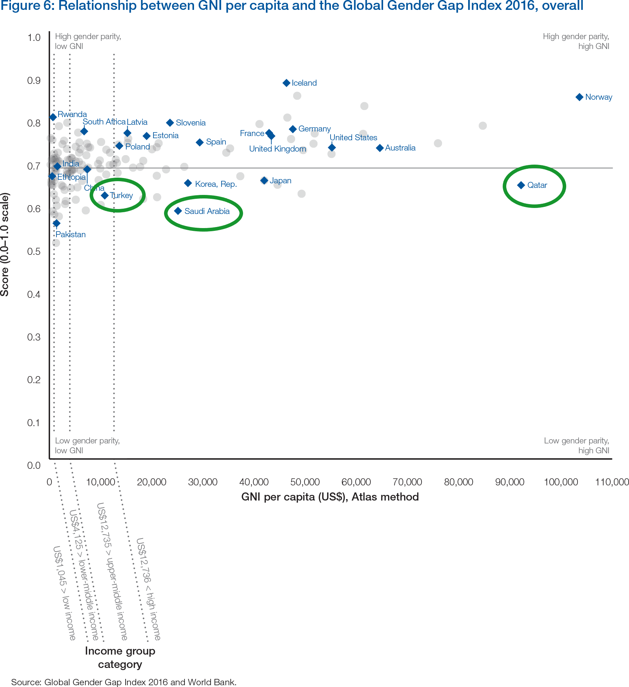

```{r setup, include=FALSE}
knitr::opts_chunk$set(echo = TRUE)
```

## Load Packages

Load all required packages.

```{r library, include=FALSE}
library(DT)
library(readr)
library(rethinking)
library(dplyr)
```

## Fit Model

### Import Data

Import the df dataset.

```{r import}
# read files
df = read.csv(file.path("datasets", "df.csv"))
```

### Preprocess Data

For better efficiency and to avoid common problems later on in Stan, we make a new trimmed down data frame.

```{r pre, eval=FALSE}
# trim data frame
df = df[ , c("log_GNI","GGI_s","SIGI_s","MENA")]

DT:::datatable(
    df,
    extensions = list("Scroller" = NULL,
                      'FixedHeader' = NULL,
                      "FixedColumns" = list(leftColumns=2)),
    options = list(
                deferRender = TRUE,
                scrollY = 200,
                scroller = TRUE,
                autoWidth=TRUE,
                pageLength = 50,
                fixedHeader = TRUE,
                dom = 't',
                scrollX = TRUE,
                fixedColumns = list(leftColumns = 2)
                  )
              )
```

.

### Fit Models With map

#### Step 1 : Fit various multiple Gaussian regressions, using map:

+ Model 1.1: log_GNI ~ 1 + GGI_s

+ Model 1.2: log_GNI ~ 1 + SIGI_s

+ Model 1.3:log_GNI ~ 1 + GGI_s + SIGI_s

```{r m1.1}
# define model fit by map
m1.1 <- map(
  alist(
    log_GNI ~ dnorm(mu, sigma),
    mu <- a + bG*GGI_s,
    a ~ dnorm(8,100),
    bG ~ dnorm(0,1),
    sigma ~ dunif(0,10)
  ),
  data <- df)
```

```{r m1.2}
# define model fit by map
m1.2 <- map(
  alist(
    log_GNI ~ dnorm(mu, sigma),
    mu <- a + bS*SIGI_s,
    a ~ dnorm(8,100),
    bS ~ dnorm(0,1),
    sigma ~ dunif(0,10)
  ),
  data <- df)
```

```{r m1.3}
# define model fit by map
m1.3 <- map(
  alist(
    log_GNI ~ dnorm(mu, sigma),
    mu <- a + bG*GGI_s + bS*SIGI_s,
    a ~ dnorm(8,100),
    bG ~ dnorm(0,1),
    bS ~ dnorm(0,1),
    sigma ~ dunif(0,10)
  ),
  data <- df)
```

.

#### Step 2 : Assess Predictors

To determine whether **GGI_s** or **SIGI_s** is a better predictor of log GNI per capita, we can start off by examining the individual parameter estimates in their separate models. 

In both Model 1.1 and 1.3, we can see that the posterior probability for **GGI_s** is distributed extremely close to zero, inferring that GGI has little importance in predicting log GNI per capita. 

```{r m1.assess}
# assess predictors across models
par(mfrow=c(3,1))
plot(precis(m1.1), main="Model 1.1")
plot(precis(m1.2), main="Model 1.2")
plot(precis(m1.3), main="Model 1.3")
```

To further understand the multiple regressions, we can use counterfactual plots to see how log GNI per capita changes as we adjust one predictor at a time to determine which is the better predictor. Lets consider the individual effects of variables **GGI_s** and **SIGI_s** in Model 1.3.

```{r m1.counter}
par(mfrow=c(1,2))

# counterfactual plot holding SIGI_s constant at its mean
# prepare new counterfactual data 
S.avg <- mean(df$SIGI_s)
G.seq <- seq( from=-3, to=2, length.out=30 )
pred.dat <- data.frame(
  GGI_s=G.seq,
  SIGI_s=S.avg
)
## compute counterfactual mean weight (mu)
mu <- link(m1.3, data=pred.dat)
mu.mean <- apply(mu, 2, mean)
mu.PI <- apply(mu, 2, PI, prob=0.95)
## simulate counterfactual weight outcomes
G.sim <- sim( m1.3, data=pred.dat, n=1e4)
G.PI <- apply( G.sim, 2, PI)
## plot
plot(log_GNI ~ GGI_s, data=df, type="n")
mtext("SIGI_s = 0")
lines(G.seq, mu.mean)
shade(mu.PI, G.seq)
shade(G.PI, G.seq)

# counterfactual plot holding SIGI_s constant at its mean
# prepare new counterfactual data 
G.avg <- mean(df$GGI_s)
S.seq <- seq( from=-1.5, to=3, length.out=30 )
pred.dat <- data.frame(
  SIGI_s=S.seq,
  GGI_s=G.avg
)
## compute counterfactual mean weight (mu)
mu <- link(m1.3, data=pred.dat)
mu.mean <- apply(mu, 2, mean)
mu.PI <- apply(mu, 2, PI, prob=0.95)
## simulate counterfactual weight outcomes
S.sim <- sim( m1.3, data=pred.dat, n=1e4)
S.PI <- apply( S.sim, 2, PI)
## plot
plot(log_GNI ~ SIGI_s, data=df, type="n")
mtext("GGI_s = 0")
lines(S.seq, mu.mean)
shade(mu.PI, S.seq)
shade(S.PI, S.seq)
```

By comparing the counterfactual plots of **GGI_s** (left) and **SIGI_s** (right) holding the other predictor constant at its mean, we can see both predictors are negatively correlated with **log_GNI**, with **SIGI_s** displaying a far more obvious negative correlation. This coincides with the coeffecients assessment conducted above - that GGI plays little importance in predicting log GNI per capita. In other words, SIGI is a sufficient enough predictor by itself.

Hence, we shall only consider Model 1.2 (log_GNI ~ 1 + SIGI_s) onwards. Exclude **GGI_s** in new dataframe.

```{r pre2, eval=FALSE}
# trim data frame
df = as.data.frame(df[ , c("log_GNI","SIGI_s","MENA")])

#write.csv(df, file.path("datasets", "df_shiny.csv"))

DT:::datatable(
    df,
    extensions = list("Scroller" = NULL,
                      'FixedHeader' = NULL,
                      "FixedColumns" = list(leftColumns=2)),
    options = list(
                deferRender = TRUE,
                scrollY = 200,
                scroller = TRUE,
                autoWidth=TRUE,
                pageLength = 50,
                fixedHeader = TRUE,
                dom = 't',
                scrollX = TRUE,
                fixedColumns = list(leftColumns = 2)
                  )
              )
```

.

### Fit Models With map & Interaction

The graph below shows the relationship between GNI per capita and GGI, based on *The Global Gender Gap Report 2016*. Most countries with high GNI per capita are western developed countries with high gender parity. However, countries in the Middle East and North Africa (MENA) region - for example, **Qatar, Saudi Arabia, and Turkey** - are seen to have high GNI per capita with low gender parity. 

.



.

Due to long-existing religious, historic, legislative, and economic barriers, extreme cases of gender discrimination prevail in the MENA countries. Although we have excluded the variable **GGI_s** from the model, the index is an important indicator of gender equality. In this case, it likely illustrates the extent to which women in social institutions "accept and expect to be discriminated against".

By adding a linear interaction between SIGI values and MENA nations, we can model the hypothesis that the slope between log GNI per capita and SIGI values is conditional upon whether or not a nation is in the MENA region.

.

#### Step 3: Add interaction

+ Model 1.4:log_GNI ~ 1 + SIGI_s*MENA

```{r m1.4}
# define model fit by map
m1.4 <- map(
  alist(
    log_GNI ~ dnorm(mu, sigma),
    mu <- a + bS*SIGI_s + bSM*SIGI_s*MENA + bM*MENA,
    a ~ dnorm(8,100),
    bS ~ dnorm(0,1),
    bM ~ dnorm(0,1),
    bSM ~ dnorm(0,1),
    sigma ~ dunif(0,10)
  ),
  data <- df)
```

Before moving on to interpret the estimates and plotting the predictions, lets use WAIC to compare this new model to the previous one. Model 1.4 has nearly 90% of the WAIC-estimated model weight, which means there is nearly 90% probability that m1.4 will make the better predictions on new data. This is a strong support for including the interaction effect; it may not come as a surprise, given the obvious observations of the GNI vs GGI graph above.

```{r m1.compare}
# compare with and without interaction
compare(m1.2, m1.4)
```

Now, lets plot the posterior predictions for the model, including the interaction between MENA and SIGI values. 
Since higher levels of SIGI indicate greater gender inequality, we can reverse order of x axis to illustrate the relationship between the
gender equality indication of SIGI values and GNI.

```{r m1.plot.inter}
par(mfrow=c(1,2))

S.seq <- seq( from=-1.5, to=3, length.out=30)

# compute counterfactual mean weight (mu)
mu.NotMENA <- link(m1.4, data=data.frame(MENA=0, SIGI_s=S.seq))
mu.NotMENA.mean <- apply(mu.NotMENA, 2, mean)
mu.NotMENA.PI <- apply(mu.NotMENA, 2, PI, prob=0.95)

mu.MENA <- link(m1.4, data=data.frame(MENA=1, SIGI_s=S.seq))
mu.MENA.mean <- apply(mu.MENA, 2, mean)
mu.MENA.PI <- apply(mu.MENA, 2, PI, prob=0.95)

# plot non-MENA nations with regression
d.M0 <- df[df$MENA==0,]
plot(log_GNI ~ SIGI_s, data=d.M0,
     col=rangi2, ylab="log GNI per capita",
     xlab="Gender Equality (reversed SIGI_s)", xlim=c(3, -1.5))
mtext("Non-MENA nations", 3)
lines(S.seq, mu.NotMENA.mean, col=rangi2)
shade(mu.NotMENA.PI, S.seq, col=col.alpha(rangi2, 0.3))
  
# plot MENA nations with regression
d.M1 <- df[df$MENA==1,]
plot(log_GNI ~ SIGI_s, data=d.M1,
     col="darkgreen", ylab="log GNI per capita",
     xlab="Gender Equality (reversed SIGI_s)", xlim=c(3, -1.5))
mtext("MENA nations", 3)
lines(S.seq, mu.MENA.mean, col="darkgreen")
shade(mu.MENA.PI, S.seq, col=col.alpha("darkgreen", 0.3))
```

.

## Conclusion

According to the counterfactual plots, we can conclude that for:

1. Non-MENA nations: Gender equality has strong positive association with GNI per capita.

2. MENA nations: Gender equality has negative association with GNI per capita. However, the wide confidence interval indicates that the sample size was too small, and hence the data is consistent with a wide range of possible hypotheses. The negative relationship needs to be replicated with a larger sample size.
